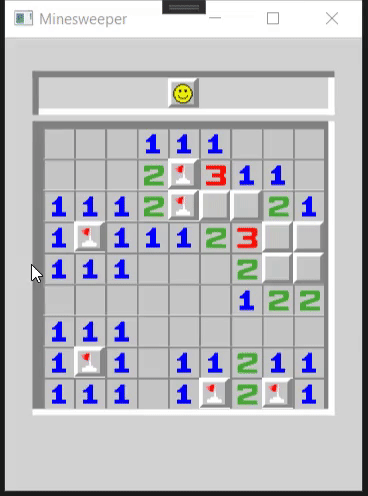

# Minesweeper
Minesweeper is a single-player puzzle video game. The objective of the game is to clear a rectangular board containing hidden "mines" or bombs without detonating any of them, with help from clues about the number of neighboring mines in each field. The game originates from the 1960s, and it has been written for many computing platforms in use today. It has many variations and offshoots.

Some versions of Minesweeper set up the board (after the first click) so that the solution does not require guessing.[1] Minesweeper for versions of Windows protects the first square revealed; from Windows Vista onward, players may elect to replay a board, in which the game is played by revealing squares of the grid by clicking or otherwise indicating each square. If a square containing a mine is revealed, the player loses the game. If no mine is revealed, a digit is instead displayed in the square, indicating how many adjacent squares contain mines; if no mines are adjacent, the square becomes blank, and all adjacent squares will be recursively revealed. The player uses this information to deduce the contents of other squares and may either safely reveal each square or mark the square as containing a mine.  [-Wikipedia](https://en.wikipedia.org/wiki/Minesweeper_(video_game)) 

